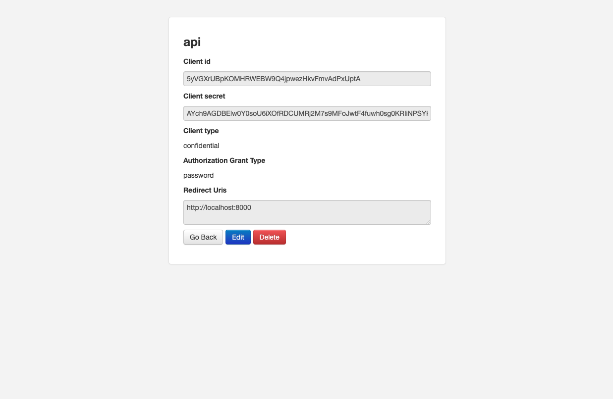
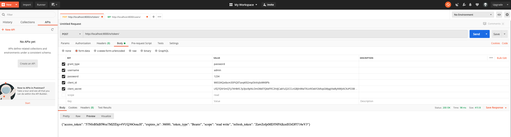
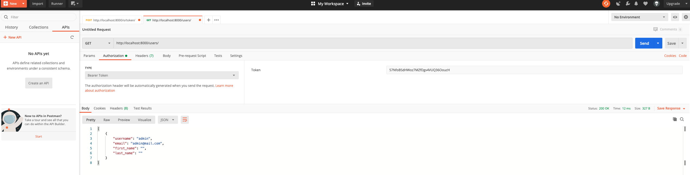

# django-oauth2-demo

django oauth2 demo project

## Installation

Create venv with command

```bash
$ python3 -m venv ./venv
```

Use venv with command

```bash
$ source venv/bin/activate
```

Install django

```bash
$ pip install django
```

Install requirments,txt

```bash
$ pip install -r requirments.txt
```

```bash
$ python manage.py migrate
$ python manage.py createsuperuser
$ python manage.py runserver
```

Login django admin http://localhost:8000/admin/

Register you application in http://localhost:8000/o/applications/


## How to build this project

Use venv with command

```bash
$ source venv/bin/activate
```

Use pip install django

```bash
$ pip install django
```

Create project backend

```bash
$ django-admin startproject backend
```

Create app api

```bash
$ cd backend
$ django-admin startapp api
```

Install django-oauth-toolkit & djangorestframework

```bash
$ pip install django-oauth-toolkit djangorestframework
```

Add oauth2_provider app & api app in backend/setting.py

```python
INSTALLED_APPS = (
    'django.contrib.admin',
    ...
    'oauth2_provider',
    'rest_framework',
    'api',
)
```

```python
REST_FRAMEWORK = {
    'DEFAULT_AUTHENTICATION_CLASSES': (
        'oauth2_provider.contrib.rest_framework.OAuth2Authentication',
    )
}
```

Add this code to url.py

```python

from django.urls import path
from django.conf.urls import include
from django.contrib.auth.models import User, Group
from django.contrib import admin
admin.autodiscover()

from rest_framework import generics, permissions, serializers

from oauth2_provider.contrib.rest_framework import TokenHasReadWriteScope, TokenHasScope

# first we define the serializers
class UserSerializer(serializers.ModelSerializer):
    class Meta:
        model = User
        fields = ('username', 'email', "first_name", "last_name")

class GroupSerializer(serializers.ModelSerializer):
    class Meta:
        model = Group
        fields = ("name", )

# Create the API views
class UserList(generics.ListCreateAPIView):
    permission_classes = [permissions.IsAuthenticated, TokenHasReadWriteScope]
    queryset = User.objects.all()
    serializer_class = UserSerializer

class UserDetails(generics.RetrieveAPIView):
    permission_classes = [permissions.IsAuthenticated, TokenHasReadWriteScope]
    queryset = User.objects.all()
    serializer_class = UserSerializer

class GroupList(generics.ListAPIView):
    permission_classes = [permissions.IsAuthenticated, TokenHasScope]
    required_scopes = ['groups']
    queryset = Group.objects.all()
    serializer_class = GroupSerializer

# Setup the URLs and include login URLs for the browsable API.
urlpatterns = [
    path('admin/', admin.site.urls),
    path('o/', include('oauth2_provider.urls', namespace='oauth2_provider')),
    path('users/', UserList.as_view()),
    path('users/<pk>/', UserDetails.as_view()),
    path('groups/', GroupList.as_view()),
    # ...
]
```

And add this code to setting.py

```python
OAUTH2_PROVIDER = {
    # this is the list of available scopes
    'SCOPES': {'read': 'Read scope', 'write': 'Write scope', 'groups': 'Access to your groups'}
}

REST_FRAMEWORK = {
    # ...

    'DEFAULT_PERMISSION_CLASSES': (
        'rest_framework.permissions.IsAuthenticated',
    )
}
```

Run command

```bash
$ python manage.py migrate
$ python manage.py createsuperuser
$ python manage.py runserver
```

Login django admin http://localhost:8000/admin/

Register you application in http://localhost:8000/o/applications/


Get token with curl with command

```bash
curl -X POST -d "grant_type=password&username=<your username>&password=<your password>" -u "Client_id:Client_secret" http://localhost:8000/o/token/
```

Result

```bash
{"access_token": "Qp7O8SMbsvboBblrvmhwxybqkjBtvA",
 "expires_in": 36000,
 "token_type": "Bearer",
 "scope": "read write",
 "refresh_token": "8UgBFM2ZyD4oTyNiSEEfy5zPNGIJ7n"
}
```

Get token with postman


Test get user

